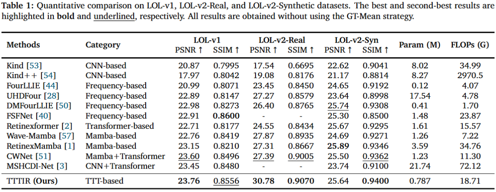
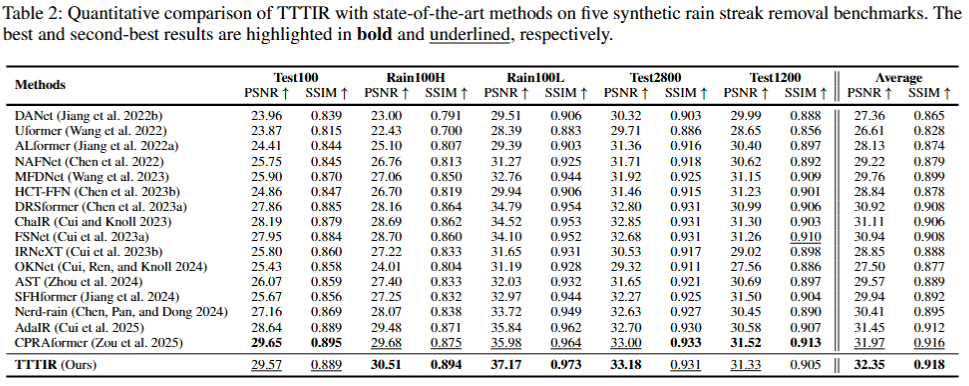
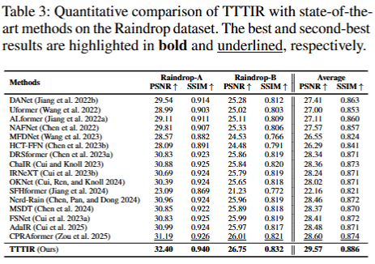
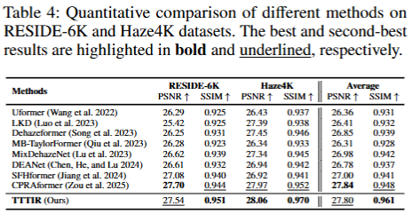
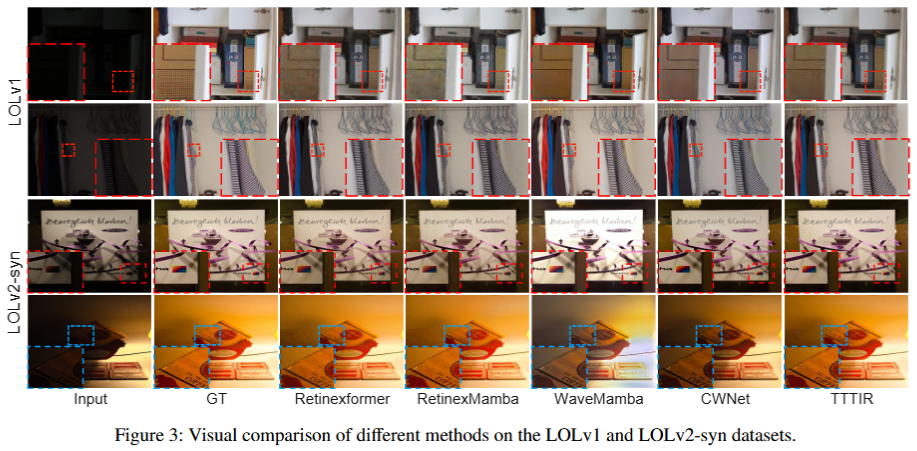
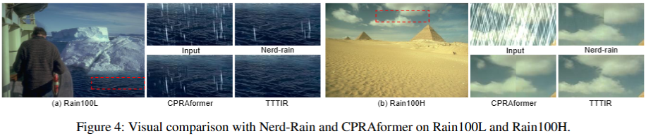

# TTTIR: Unlocking Instance-Specific State Evolution via Test-Time Training for Image Restoration

**Kaihang Zheng<sup>\*</sup>**, **Jun Li<sup>\*</sup>**, Hang Guo, Hongyu Chi, Zimo Liu, Tao Dai, **Jinpeng Wang<sup>&dagger;</sup>**, and **Yaowei Wang<sup>&dagger;</sup>**

<sup>\*</sup>Equal contribution &nbsp; <sup>&dagger;</sup>Corresponding authors

[](#) [](#model-zoo) [](#results)

## News

- **2026-08-05:** The initial codebase is released.

---

> **Abstract:** Image restoration is inherently challenging due to the diverse and highly input-dependent nature of real-world degradations. While recent architectures such as Transformers and state-space models have advanced the field, they predominantly rely on static, globally shared parameters, which struggle to fully accommodate instance-specific degradation patterns. To address this limitation, we propose **TTTIR**, a framework that reformulates image restoration as an instance-specific state evolution process. Progressive State Sequence Generation (PSSG) constructs complementary spatial-frequency target states that define what to recover, while State Transition Evolution (STE) adapts lightweight transition operators through a restoration-oriented test-time training inner loop that determines how features should evolve. Extensive experiments demonstrate strong performance across low-light enhancement, rain removal, and image dehazing benchmarks with favorable computational scalability.

---

## Contents

1. [Dependencies](#dependencies)
2. [Datasets](#datasets)
3. [Training](#training)
4. [Testing](#testing)
5. [Model Zoo](#model-zoo)
6. [Results](#results)

## Dependencies

- Python 3.7.12
- PyTorch
- NVIDIA GPU and CUDA

<details>
<summary><b>Click to expand installation commands</b></summary>

```bash
git clone https://github.com/Elysiaaaaaaaa/TTTIR.git
cd TTTIR

conda create -n tttir python=3.7.12 -y
conda activate tttir

# The dependency file will be released soon.
pip install -r requirement.txt
```

</details>

Choose a PyTorch build compatible with your CUDA version. The experiments in the paper were conducted on NVIDIA RTX 3080 Ti GPUs.


## Datasets

The datasets used for training and evaluation are listed below. Download links will be added after the processed datasets are finalized.

| Task | Training set | Testing set |
|:--|:--|:--|
| Low-light enhancement | LOL-v1 | LOL-v1, LOL-v2-Real |
| Low-light enhancement | LOL-v2-Synthetic | LOL-v2-Synthetic |
| Rain streak removal | Rain13K | Test100, Rain100H, Rain100L, Test1200, Test2800 |
| Raindrop removal | Raindrop training set | Raindrop-A, Raindrop-B |
| Image dehazing | RESIDE-6K | RESIDE-6K |
| Image dehazing | Haze4K | Haze4K |

Organize the datasets under a common root directory:

<details>
<summary><b>Click to expand the dataset directory structure</b></summary>

```text
<dataset_root>/
|-- LOLv1/
|   |-- Train/
|   |   |-- input/
|   |   `-- target/
|   `-- Test/
|       |-- input/
|       `-- target/
|-- LOLv2/
|   |-- Real_captured/
|   |   |-- Train/
|   |   |   |-- Low/
|   |   |   `-- Normal/
|   |   `-- Test/
|   |       |-- Low/
|   |       `-- Normal/
|   `-- Synthetic/
|       |-- Train/
|       |   |-- Low/
|       |   `-- Normal/
|       `-- Test/
|           |-- low1/
|           `-- Normal/
|-- Rain13k/
|   |-- train/
|   |   |-- input/
|   |   `-- target/
|   `-- test/
|       |-- Rain100H/
|       |   |-- input/
|       |   `-- target/
|       |-- Rain100L/
|       |   |-- input/
|       |   `-- target/
|       |-- Test100/
|       |   |-- input/
|       |   `-- target/
|       |-- Test1200/
|       |   |-- input/
|       |   `-- target/
|       `-- Test2800/
|           |-- input/
|           `-- target/
|-- raindrop/
|   |-- train/
|   |   |-- data/
|   |   `-- gt/
|   |-- test_a/
|   |   |-- data/
|   |   `-- gt/
|   `-- test_b/
|       |-- data/
|       `-- gt/
|-- RESIDE-6K/
|   |-- train/
|   |   |-- haze/
|   |   `-- gt/
|   `-- test/
|       |-- haze/
|       `-- gt/
`-- Haze4K/
    |-- train/
    |   |-- haze/
    |   |-- gt/
    |   `-- trans/
    `-- test/
        |-- haze/
        |-- gt/
        `-- trans/
```

</details>


## Training

### Rain streak and raindrop removal

<details>
<summary><b>Click to expand the training command</b></summary>

```bash
cd derain

CUDA_VISIBLE_DEVICES=2,3 python -m torch.distributed.launch \
    --nproc_per_node 2 \
    --use_env \
    --master_port 6198 \
    main.py \
    --model_name Rain13k \
    --mode train \
    --num_epoch 300 \
    --data_dir /data2/zhengkaihang/ttt/dataset/Rain13k \
    --learning_rate 1e-3 \
    --save_freq 30 \
    --valid_freq 1 \
    --batch_size 4 \
    --num_worker 6
```

</details>

### Low-light enhancement

Training settings and dataset paths are defined in YAML files under `lowlight/options/train/`.

<details>
<summary><b>Click to expand the training commands</b></summary>

```bash
cd lowlight

# LOL-v1
python train.py -opt options/train/LOL-v1.yml

# LOL-v2-Synthetic
python train.py -opt options/train/LOL-Syn.yml
```

</details>


## Testing

### Rain streak and raindrop removal

<details>
<summary><b>Click to expand the testing command</b></summary>

```bash
cd derain

CUDA_VISIBLE_DEVICES=0 python main.py \
    --mode test \
    --data_dir /data2/zhengkaihang/ttt/dataset/Rain13k \
    --test_model /path/to/model.pkl \
    --model_name Rain100H
```

</details>


### Low-light enhancement


<details>
<summary><b>Click to expand the testing commands</b></summary>

```bash
cd lowlight

# LOL-v1
python test.py -opt options/test/LOL-v1.yml

# LOL-v2-Real evaluated with the LOL-v1 model
python test.py -opt options/test/LOL-v2-Real-Based_v1.yml

# LOL-v2-Synthetic
python test.py -opt options/test/LOL-v2-Syn.yml
```

</details>

## Model Zoo

| Task | Training set | Evaluation set(s) | Checkpoint |
|:--|:--|:--|:--:|
| Low-light enhancement | LOL-v1 | LOL-v1, LOL-v2-Real | [Models & results](https://pan.baidu.com/s/1bPD69WYEbDRMIPhUVCdJMQ) (code: `a4r4`) |
| Low-light enhancement | LOL-v2-Synthetic | LOL-v2-Synthetic | [Models & results](https://pan.baidu.com/s/1bPD69WYEbDRMIPhUVCdJMQ) (code: `a4r4`) |
| Rain streak removal | Rain13K | Test100, Rain100H, Rain100L, Test1200, Test2800 | [Models & results](https://pan.baidu.com/s/1WDROnwPjT8WMAZtl_F7ZOg) (code: `8jf2`) |
| Raindrop removal | Raindrop training set | Raindrop-A, Raindrop-B | [Models & results](https://pan.baidu.com/s/1-BlJ3c00GGUbzarwCeG1tQ) (code: `hs0z`) |
| Image dehazing | RESIDE-6K | RESIDE-6K | Coming soon |
| Image dehazing | Haze4K | Haze4K | Coming soon |

## Results

Detailed results are reported in the paper. Click each section below to view the quantitative and qualitative comparisons.

<details>
<summary><b>Quantitative comparison</b> (click to expand)</summary>

#### Low-light enhancement

<p align="center">
  
</p>

<p align="center"><b>Table 1.</b> Quantitative comparison on LOL-v1, LOL-v2-Real, and LOL-v2-Synthetic.</p>

#### Rain streak removal

<p align="center">
  
</p>

<p align="center"><b>Table 2.</b> Quantitative comparison on Test100, Rain100H, Rain100L, Test2800, and Test1200.</p>

<table>
  <tr>
    <td align="center" width="50%"><b>Raindrop removal</b></td>
    <td align="center" width="50%"><b>Image dehazing</b></td>
  </tr>
  <tr>
    <td align="center" width="50%">
      
    </td>
    <td align="center" width="50%">
      
    </td>
  </tr>
  <tr>
    <td align="center" width="50%"><b>Table 3.</b> Raindrop-A and Raindrop-B.</td>
    <td align="center" width="50%"><b>Table 4.</b> RESIDE-6K and Haze4K.</td>
  </tr>
</table>

</details>

<details>
<summary><b>Visual comparison</b> (click to expand)</summary>

### Low-light enhancement

<p align="center">
  
</p>

<p align="center"><b>Figure 3.</b> Visual comparison on LOL-v1 and LOL-v2-Synthetic.</p>


### Rain removal

<p align="center">
  
</p>

<p align="center"><b>Figure 4.</b> Visual comparison with Nerd-Rain and CPRAformer on Rain100L and Rain100H.</p>

</details>

## Citation

If this work is useful for your research, please cite it. The final BibTeX entry will be updated when the paper identifier and venue are available.

```bibtex
@article{zheng2026tttir,
  title   = {TTTIR: Unlocking Instance-Specific State Evolution via Test-Time Training for Image Restoration},
  author  = {Zheng, Kaihang and Li, Jun and Guo, Hang and Chi, Hongyu and Liu, Zimo and Dai, Tao and Wang, Jinpeng and Wang, Yaowei},
  journal = {arXiv preprint},
  year    = {2026}
}
```


## License

This project is released under the [Apache License 2.0](LICENSE).
